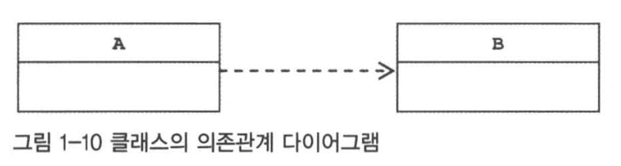
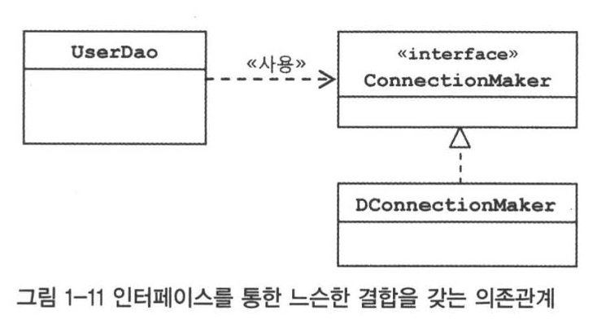

## 스프링이란?

- 자바를 기반으로 한 프레임워크
- 오브젝트를 효과적으로 설계 / 구현 / 사용 할지에 대한 가이드라인을 제공

## DAO(Data Access Object)

- DB를 사용해 데이터를 조회하거나 조작하는 기능을 전담하도록 만든 오브젝트
- *레코드와 오브젝트의 브릿지 역할을 하는것 같아요*

```java
public class UserDao {
    public void add(User user) throws ClassNotFoundException, SQLException {
        Connection connection = DriverManager.getConnection("jdbc:mysql://localhost/springbook", "root", "1234");

        PreparedStatement ps = connection.prepareStatement("insert into users(id, name, password) values(?,?,?)");
        ps.setString(1, user.getId());
        ps.setString(2, user.getName());
        ps.setString(3, user.getPassword());

        ps.executeUpdate();

        ps.close();
        connection.close();
    }

    public User get(String id) throws ClassNotFoundException, SQLException {
        Connection connection = DriverManager.getConnection("jdbc:mysql://localhost/springbook", "root", "1234");

        PreparedStatement ps = connection.prepareStatement("select * from users where id = ?");
        ps.setString(1, id);

        ResultSet rs = ps.executeQuery();
        rs.next();
        User user = new User();
        user.setId(rs.getString("id"));
        user.setName(rs.getString("name"));
        user.setPassword(rs.getString("password"));

        rs.close();
        ps.close();
        connection.close();

        return user;
    }
}
```

### 관심사의 분리

- 위 DAO의 문제점
    - 변경이 발생하면? 
    - add, update, upsert, 등등등 많은 메서드가 있다면?
    - **으악! 지옥이야** -> 관심사를 분리하자!

### 상속을 통한 확장

- `UserDao`를 Abstract Class로, getConnection을 Abstract method로 변경!
- `UserDao`를 구현하는 클래스를 새로 만들면 된다.
- **추상 메서드**를 만든 후, 이를 구현해서 사용하게 하는 것을 **템플릿 메서드 패턴**이라고 한다.
- *왠지 상속은 안티 패턴같은 기분이 들어요.*

```java
public abstract class UserDao2 {
    ...

    public abstract Connection getConnection() throws SQLException;
}


public class KakaoUserDao extends UserDao2 {

    @Override
    public Connection getConnection() throws SQLException {
        return null;
    }
}
```

### 컴포지션을 통한 확장

- 상속의 문제
  - 다른 클래스를 상속해야 한다면?
  - 자바는 다중 상속을 할 수 없다!
  - *Mixin이 있었다면? 다중상속처럼 과용하게 될까요?*
  
- `ConnectionMaker`인터페이스를 만들고, 구현체를 생성자/메서드로 주입하는 방식
  - *개인적으로는 생성자가 훨씬 낫다고 생각해요*
- 더 이상 `UserDao`는 상속하지도 않으면서, 특정 `Connection`에 종속되지도 않게됨.

```java
static void main() {
    UserDao3 dao = new UserDao3(new SimpleConnectionMaker());
    ...
}

public interface ConnectionMaker {
    public Connection makeConnection() throws ClassNotFoundException, SQLException;
}

public abstract class UserDao3 {
    private ConnectionMaker connectionMaker;

    public UserDao3(ConnectionMaker connectionMaker) {
        this.connectionMaker = connectionMaker;
    }

    ...
}
```

## 기타

### 개방 폐쇄 원칙 (OCP, Open-Closed Principle)

- 클래스나 모듈은 확장에는 열려있어야 하고, 변경에는 닫혀있어야 한다.
- `UserDao`의 경우, 별개의 DB 커넥션 활용에는 열려있고, 핵심 로직 변경은 닫혀있다.

### 응집과 결합

- 높은 응집도
    - 관심사가 깊은 오브젝트들이 같이 관계를 맺고 있는 것. 
    - 변경이 일어날때 한꺼번에 수정해야 함.
- 낮은 결합도
    - 관심사가 다른 오브젝트들이 느슨하게 관계를 맺고 있는 것. (`SimpleConnectionMaker`와 `UserDao`의 관계)
    - 변경이 일어날때, 수정사항이 적다.

### 자바빈

- 다음 두가지를 가진 오브젝트
  - 디폴트 생성자를 가지고 있음. 리플렉션을 이용해서 오브젝트를 생성해야 하기 때문
  - 프로퍼티가 있어야 함 (set, get으로 수정, 조회)
    - *요즘에는 생성자 주입이 더 권장되는 방식인 걸로 앎*

## 제어의 역전 (IoC)

- 클라이언트에서 `UserDao`를 **사용**하긴 하지만, 의존성 주입까지 하는건 너무 과한 책임.
- 의존성 주입을 도맡아 하는 팩토리 오브젝트를 만들자.

```java
public class DaoFactory {
    public UserDao3 userDao3() {
        UserDao3 userDao3 = new UserDao3(connectionMaker());
        return userDao3;
    }

    public ConnectionMaker connectionMaker() {
        return new SimpleConnectionMaker();
    }
}
```

- *조금 다르지만, Python Fastapi에서도 권장하는 방식이예요. 스프링은 자동이란게 정말 멋진것 같아요.*
```python
# 이런식으로 객체 생성자가 객체를 만들어서 클라이언트에게 던져줍니다.
async def get_pokedex_item_repository(session: SessionDep) -> PokedexItemRepository:
    return PokedexItemRepository(session)
```

- **제어의 역전**이란?
  - 클라이언트가 자신이 사용할 오브젝트를 선택하지 않고, 생성하지 않고, 오브젝트 팩토리에게 위임하는 것.
  - 보통 대부분의 프레임워크를 사용할때 우리는 `main()`에서 핵심 로직을 시작하지 않는다. 
    - 이를 프레임워크에 위임하는 것. 
    - 프레임워크 또한 제어의 역전을 사용하는 것.

### IoC 용어 정리

- Bean: 스프링이 생성하고 제어하는 오브젝트
- Bean Factory: 빈을 생성/등록/조회 하는 컨테이너
- Application Context: 빈 팩토리를 상속한 IoC 컨테이너 (여러가지 기능을 확장함, 앱 실행시 **싱글톤 빈**을 생성해줌)

## 싱글톤 레지스트리와 오브젝트 스코프

### 싱글톤 레지스트리로서의 애플리케이션 컨텍스트

- 기존의 `DaoFactory`의 문제점
    - 매번 Dao를 생성할때마다 다른 객체가 생성된다.
    ```java
    DaoFactory factory = new DaoFactory();
    UserDao dao1 = factory.userDao();
    UserDao dao2 = factory.userDao();

    System.out.println(dao1 == dao2); // false
    ```    

- `ApplicationContext`에서 빈을 호출하면, 항상 같은 빈을 돌려준다.
    ```java
    ApplicationContext context = new AnnotationConfigApplicationContext(DaoFactory.class);

    UserDao dao3 = context.getBean("userDao", UserDao.class);
    UserDao dao4 = context.getBean("userDao", UserDao.class);

    System.out.println(dao1 == dao2); // true
    ```

- 왜 싱글톤으로 만들까?
    - 대규모의 엔터프라이즈 서버 환경에서, 초당 수백번의 요청을 받아 처리해야 할 상황이 많다.
    - 요청마다 객체를 생성해야 한다면 너무 많고, 부하가 심할것!
    - 때문에 하나의 객체만 만들어서 사용한다.
    - 기본적으로는 *싱글톤 빈은 무상태 방식으로 만들어야 한다!* 여러 스레드가 접근할때 병목현상 & 데이터 오염(Racing Condition)이 발생할 수 있기 때문!
        - 상태가 필요하다면? 객체 필드가 아닌, **로컬변수**, **파라미터**, **리턴 값**을 활용하자.

- 그냥 빈 객체를 싱글톤으로 만들면 안되나?
    - 1. 싱글톤은 상속하기 어렵다. (private 생성자)
    - 2. 싱글톤은 테스트 하기 어렵다. (Fake 객체를 주입하기도 어렵다.)
    - 3. 싱글톤은 하나가 아닐수도 있다! (여러개의 JVM 환경인 경우 -> *이건 Spring도 마찬가지*)
    - 4. 싱글톤 객체는 커버리지가 전역이라 결합도가 높아지기 쉽다. *사람을 믿지 말고 구조를 믿자!*

- 싱글톤 레지스트리
    - 스프링은 빈을 POJO (평범한 Java 객체)를 싱글톤 처럼 사용할 수 있게 레지스트리에 관리한다.
    - *`DefaultSingletonBeanRegistry`에서 싱글톤 빈들을 저장하는 것 같아요*

- 스프링 빈의 스코프
    - 빈이 생성되고 존재하고, 적용되는 범위
    - singleton 스코프(기본): 스프링 컨테이너 내에 한 개의 객체만 존재
    - prototype 스코프: 컨테이너에 빈을 요청할때마다, 새 객체를 생성
    - request 스코프: HTTP 요청이 생길때 마다 생성
    - session 스코프: HTTP 세션과 동일한 생명주기 *로그인이나, 장바구니 같은 곳에 활용하기 좋을듯!*
    - 스코프 지정 방법 *최신 스프링 부트는 어노테이션 기반을 활용*
        ```java
        @Component
        @Scope("prototype")
        public class MyBean { ... }
        ```

## 의존관계 주입(DI)

- 의존관계
    - 
    - 의존하고 있다는건 `B`가 변하면 `A`에 영향을 미친다는 뜻
    - 의존 관계에는 방향성이 있다.

- 느슨한 관계의 효과
    - 
    - `UserDao`가 구현체 `DConnectionMaker`를 직접 의존하지 않고, 인터페이스를 의존해서 변경에 자유로워진다!
    - `DConnectionMaker`를 수정해도 `UserDao`에 영향을 주지 않게 되었다.

- 의존성 주입 (*의존성이란 용어가 더 입에 붙어서 병행해 사용하겠습니다.*)
    - 의존성은 런타임시에도 설정될 수 있다.
    - 의존성 주입은 런타임에 구체적인 의존 받는 객체에 의존성(의존객체)를 연결해주는 것
    - 보통 스프링 애플리케이션 컨텍스트에서 생성자 주입으로 의존성 빈을 주입해줌

- 의존관계 검색(Dependency lookup)과 주입
    - 의존 받는 객체가 컨테이너에서 직접 의존성을 가져오는 방식.
        ```java
        public UserDao() {
            var context = new AnnotationConfigApplicaitonContext(DaoFactory.class);
            this.connectionMaker = context.getBean("connectionMaker", ConnectionMaker.class); // 여전히 코드에서 구현체를 참조하지 않음
        }
        ```
    - 하지만, **스프링 컨테이너 객체**에 의존하게 되는 문제가 있다!
    - DI를 사용하는 편이 낫다.

- *의존성 주입의 장점 중 연결횟수 카운팅 기능(CountingConnectionMaker)에 대한 의견...*
    - *Python의 데코레이터 같음.*
        - *DB Session을 관리할때 이런식으로 많이 씀*
            ```python
            # 데코레이터는 아니지만..
            async def get_session() -> AsyncGenerator[AsyncSession, None]:
                async with AsyncSession(engine, expire_on_commit=False) as session:
                    yield session
                    await session.commit()
            ```
    - *뒤에 나올 AOP의 밑밥 같음*
        - *Gemini도 그렇다고 하고, @Transaction이 이런 원리로 동작한다고 함*

### DataSource 인터페이스로 변경 (1.8 XML 에서 발췌)

- `UserDao`의 `ConnectionMaker`대신 자바에서 DB 커넥션을 가져오는 `DataSource`를 사용하자.
- `ConnectionMaker` -> `DataSource` 변경
    ```java
    public class UserDao {
        private DataSource dataSource;

        public UserDao(DataSource dataSource) {
            this.dataSource = dataSource;
        }

        public void add(User user) throws SQLException {
            Connection connection = dataSource.getConnection();
            ...
        }
        ...
    }
    ```
- 빈 등록
    ```java
    @Configuration
    public class DaoFactory {
        ...

        @Bean
        public DataSource dataSource() {
            SimpleDriverDataSource dataSource = new SimpleDriverDataSource();

            dataSource.setDriverClass(com.mysql.cj.jdbc.Driver.class);
            dataSource.setUrl("jdbc:mysql://localhost/springbook");
            dataSource.setUsername("root");
            dataSource.setPassword("1234");

            return dataSource;
        }
    }
    ```

## (추가) 현대적인 방식은 없을까?

### application.properties 에서의 커넥션 설정

- 굳이 데이터 소스 객체를 만들지 않고, 설정파일에 등록하면, 빈으로 등록 
    ```properties
    spring.datasource.driver-class-name=com.mysql.cj.jdbc.Driver
    spring.datasource.url=jdbc:mysql://localhost/springbook
    spring.datasource.username=root
    spring.datasource.password=1234
    ```

### Annotation 기반의 빈 등록

- `@SpringBootApplication`에는 `@ComponentScan`가 있어서 `@Component`가 붙은 클래스를 자동으로 빈으로 만들어 `싱글톤 레지스트리`에 등록해준다.
    ```java
    @Component
    public class UserDao {
        private DataSource dataSource;

        public UserDao(DataSource dataSource) {
            this.dataSource = dataSource;
        }
        ...

    }
    ```
