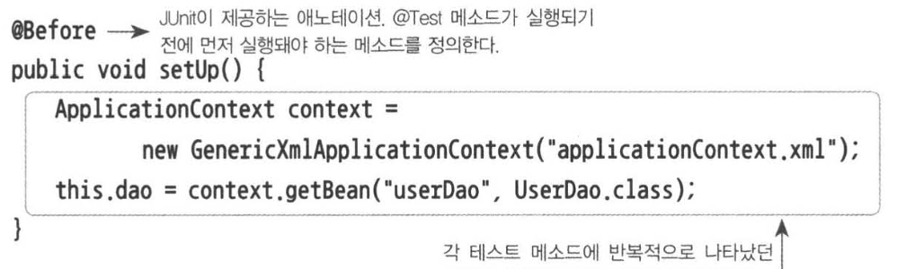
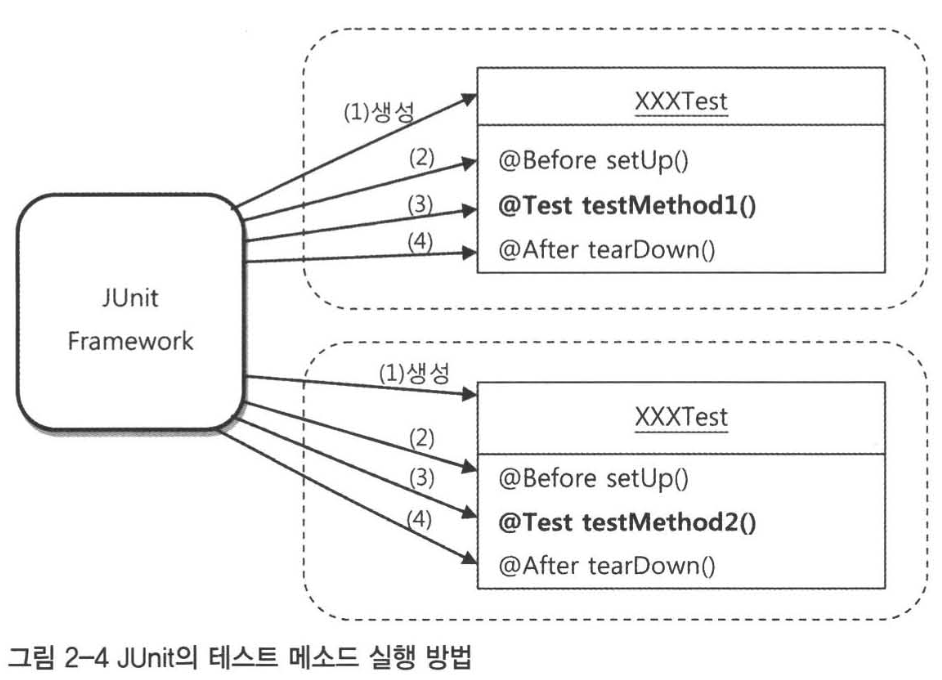

## 테스트

- 테스트를 해야 하는 이유

    - 변경사항이 있을 때, 이전 코드가 명세를 잘 따르는지 확인하기 위함.

- 웹을 통한 테스트 방식의 문제점

    - 웹 서버, 스프링 서버, DB, 화면단을 띄워서 직접 기능을 사용해 보는 방법
    - 문제가 뭘까?

        1. 테스트 시점이 너무 늦다.
            - 간단한 `DAO`의 기능만 테스트 하려 했지만, 컨트롤러부터, 화면단까지 구현할 부분이 많다!
        2. 에러 메시지가 어느 곳에서 생겼는지 파악하기 어렵다!
            - `DAO` 기능 테스트 이지만, SQL 문법에서 오류가 생긴건지, API 호출 문제인지, 네트워크 문제인지 경우의 수가 너무 복잡해진다!
            - *결국 내 테스트 커버리지에 속해있는 코드, 모듈, 프로그램이 커지면 커질 수록 파악하는데 어려움을 겪게 되는 것 같음.*
            - *AI를 사용한다고 하더라도 토큰량이 많을테니 커버리지는 작을 수록 좋다.*

- 단위 테스트

    - 작은 단위로 쪼개서 관심있는 기능만 테스트 하는 법
    - **단위의 기준**

        - 작을 수록 좋다.
        - *토프링 책에서는 DB에 종속되어도 단위 테스트로 볼 수 있다고 했음.*
        - *책 클린코드 에서는 더 이상 쪼갤 수 없는 것을 하나의 단위로 지향하는 것 같음.*
        - *전자는 테스트를 작성하기 좋지만, 느리면서 순수하지 않고*
        - *후자는 깔끔, 명확하지만, 리팩토링에 취약*

    - 단위를 묶은 통합테스트도 물론 필요하다.

- 자동 수행 테스트

    - 테스트 코드를 작성해두면, 자동으로 기능들을 검증할 수 있음.
    - 이슈를 처리한 후, 자동으로 테스트를 함으로써 신뢰도를 높임.

        - *테스트 통과를 보면 기분이 좋아져요*
        - *시스템이 커지고 나면 기능을 수정할때마다 꽤 많은 테스트를 하게 될테니 빠르게 테스트 할 수 있으면 좋다*

## JUnit

- *이전 주차에서 xml나 @Configuration 클래스 대신 스프링 부트의 컨텍스트를 활용했습니다.*
- *assertThat()은 assertj의 함수를 사용했습니다.*
- ex) JUnit을 적용한 UserDaoTest
    ```java
    @SpringBootTest
    class UserDaoTest {

        @Autowired
        UserDao userDao;

        @Test
        public void addAndGet() throws SQLException {
            User user = new User();
            user.setId("2jun0");
            user.setName("이준영");
            user.setPassword("1234");

            userDao.add(user);

            User added = userDao.get(user.getId());

            assertThat(user.getName()).isEqualTo(added.getName());
            assertThat(user.getPassword()).isEqualTo(added.getPassword());
        }
    }
    ```
- JUnit 프레임워크를 실행하는 코드?
     
    ```java
    public static void main() {
        JUnitCore.main("springbook.user.dao.UserDaoTest");
    }
    ```
    - 하지만, 위 코드로 JUnit 프레임워크를 실행하지 않고, 보통 Intellij의 기능을 활용함.
    - Gemini의 말.
        > IDE(IntelliJ 등)의 동작 방식
        >
        > IntelliJ에서 테스트 옆의 초록색 화살표를 누르면, 하단 [Run] 탭에 실행되는 아주 긴 명령어(Command)가 뜹니다. 그걸 자세히 뜯어보면 다음과 같은 구조입니다.
        >
        > 실행 주체: java.exe (자바 가상 머신)
        >
        > 실행 클래스: com.intellij.rt.junit.JUnitStarter (IntelliJ가 만든 전용 실행기)
        >
        > 전달 인자: -ideVersion5 ... your.package.UserDaoTest
        >
        > 즉, IntelliJ가 자기들이 만든 JUnitStarter라는 메인 메서드를 실행하면서, "이 클래스 안에 있는 @Test들을 돌려줘!"라고 명령을 내리는 것입니다.

- `addAndGet()` 테스트의 문제점

    - 멱등성을 보장하지 않음.
        - 실행할때마다 항상 같은 결과를 보장해야함.
    - 테스트 데이터가 DB에 저장되어 다음 테스트시 에러가 나온다! (pk unique error)

- 동일한 결과를 보장하는 테스트

    - `userDao`에서 새로운 기능을 구현함.
    - `deleteAll`으로 항상 DB를 초기화 하고, `getCount`으로 레코드 추가를 검증하자.
        ```java
        @Test
        public void addAndGet() throws SQLException {
            userDao.deleteAll(); // 레코드를 모두 비운다.
            assertThat(userDao.getCount()).isEqualTo(0); // 레코드 비운것을 검증한다.

            User user = new User();
            user.setId("2jun2");
            user.setName("이준영");
            user.setPassword("1234");

            userDao.add(user);
            assertThat(userDao.getCount()).isEqualTo(1); // 레코드가 추가된 것을 검증한다.

            User added = userDao.get(user.getId());

            assertThat(user.getName()).isEqualTo(added.getName());
            assertThat(user.getPassword()).isEqualTo(added.getPassword());
        }
        ```
    - 새로 추가한 함수를 믿을 수 있을까? 

- 테스트 개선

    - `count` 함수가 정말 레코드를 추가한 만큼 반환할까? => `count` 테스트를 추가함.
        ```java
        @Test
        public void count() throws SQLException {
            User user1 = new User("2jun0", "이준영", "1234");
            User user2 = new User("2jun1", "김준영", "1234");
            User user3 = new User("2jun2", "박준영", "1234");

            userDao.deleteAll();
            assertThat(userDao.getCount()).isEqualTo(0);

            userDao.add(user1);
            assertThat(userDao.getCount()).isEqualTo(1);

            userDao.add(user2);
            assertThat(userDao.getCount()).isEqualTo(2);

            userDao.add(user3);
            assertThat(userDao.getCount()).isEqualTo(3);
        }
        ```
    - `get`함수가 아무거나 조회해오는건 아닐까? => `andAndGet`의 개선. 
        ```java
        @Test
        public void addAndGet() throws SQLException {
            userDao.deleteAll();
            assertThat(userDao.getCount()).isEqualTo(0);

            User user1 = new User("2jun0", "이준영", "1234");
            User user2 = new User("2jun1", "김준영", "1234");

            userDao.add(user1);
            userDao.add(user2);
            assertThat(userDao.getCount()).isEqualTo(2);

            User added1 = userDao.get(user1.getId());
            assertThat(user1.getName()).isEqualTo(added1.getName());
            assertThat(user1.getPassword()).isEqualTo(added1.getPassword());

            User added2 = userDao.get(user2.getId());
            assertThat(user2.getName()).isEqualTo(added2.getName());
            assertThat(user2.getPassword()).isEqualTo(added2.getPassword());
        }
        ```
    - `get` 함수의 결과가 없는 경우 구현 후, 테스트
        - *값이 없을 때 예외를 던지는 것보다, Optional 이나 null이 나을듯해요*
        - *예외는 비쌉니다! 예외 객체를 만드는 것만 해도, 스택을 트레이스를 생성하기 때문!*
        ```java
        @Test
        public void getUserFail() throws SQLException {
            userDao.deleteAll();
            assertThat(userDao.getCount()).isEqualTo(0);

            // Assertj를 활용한 예외 확인
            assertThatThrownBy(() -> userDao.get("unknown_id"))
                    .isInstanceOf(EmptyResultDataAccessException.class);
        }
        ```
    - 항상 네거티브 테스트를 먼저 만들어야 한다.
        - 내 PC에선 되는데? -> 성공하는 케이스만 고려했다는 것임.
    - **TDD**: 테스트를 작성한 후, 기능을 구현하는 개발방식
        - *나중에 테스트 주도 개발 방법론을 실천해보거나 관련 책을 보는 것도 좋을듯!*
    - `@BeforeEach`을 이용한 공통 코드 분리
        - `@BeforeEach`은 각 `@Test`가 실행되기 전 호출된다.
        - 
    - 각 테스트 메소드를 실행할때마다 클래스 인스턴스를 새로 생성한다. 
        - 각 테스트들의 독립성을 위한 것 
        - *병렬로 실행하나? 싶었지만 JUnit의 경우, 순차적으로 실행한다고 합니다.*
        - *아마 제 생각에는, 테스트가 상태를 가지는 빈을 조작한다거나, DB 사용이나 외부 API호출이 있을시 문제가 생기는 것 때문인 듯!*
        - 
    - **픽스처**: 테스트를 수행하는 데 필요한 정보나 객체
        - 예제 테스트에서 사용되는 객체들을 다음과 같이 분리할 수 있다.
        - *getUserFail()의 경우 해당 픽스처들이 필요하지 않은데, 굳이 객체를 생성해야 할까?*
        - *현재로선 비용이 크지 않으니 괜찮은 것 같아요.*
            ```java
            class UserDaoTest {
                @Autowired
                private UserDao userDao;
                private User user1;
                private User user2;
                private User user3;

                @BeforeEach
                public void setUp() {
                    user1 = new User("2jun0", "이준영", "1234");
                    user2 = new User("2jun1", "김준영", "1234");
                    user3 = new User("2jun2", "박준영", "1234");
                }
                ...
            }
            ```
    - 테스트 메소드의 컨텍스트 공유
        - *책의 예제와 실습하는 코드가 달라 주입되는 빈으로 확인했습니다.*
        - `UserDao` 빈이 같은걸 확인할 수 있다.
            ```log
            org.example.tobystudy3.UserDao@7d4135c9
            org.example.tobystudy3.UserDao@7d4135c9
            org.example.tobystudy3.UserDao@7d4135c9
            ```
        - 같은 빈을 사용하는 이유
            - 스프링 컨텍스트를 한번만 초기화해, 테스트 속도를 빠르게 함.
            - 테스트 실행 속도가 `726ms` -> `40ms` -> `24ms`로 줄어들었다!
        - *완전히 같은 테스트 코드를 여러번 돌려도 속도가 줄어들까?*
            - `count()` 함수를 3개 더 만들어 테스트를 진행해보았다.
            - `626ms` -> `55ms` -> `40ms` -> `39ms`
            - 추측건데, **JIT 컴파일러 최적화** 때문이 아닐까? 
    - DI와 테스트
        - *테스트에도 DI를 사용할 수 있다는 건 1편과 요지가 같으니 넘어갑니다.*
        - 테스트용 `DataSource` 으로 `SingleConnectionDataSource`를 쓰는게 좋다?
            - DB 커넥션을 하나만 만들어 두고 계속 사용하기 때문!
            - 하지만.. 현재 스프링 부트는 기본적으로 `HikariCP`를 쓴다!
            - 히카리풀은 미리 커넥션을 여러개 만들어 두기 때문에 테스트 뿐만 아니라 서비스에도 유리함.
            - 히카리풀도 `DataSource` 구현체임 -> `HikariDataSource`
    - `@DirtiesContext`
        - 컨텍스트를 재활용하지 말라는 어노테이션 표시
    - 테스트를 위한 설정
        - *`@ContextConfiguration`을 쓸 수도 있지만 다른 방식을 활용해봤습니다.*
        - `src/test/resources`의 `application.properties`를 추가해서 설정을 줄 수 있음.
    - 스프링 컨텍스트에 독립적인 테스트
        - 가장 가볍고, 빠르고 간결함.

## 학습 테스트

- 자신이 만들지 않은 코드에 대해 작성한 테스트
- 장점
    - 다양한 조건에 따른 기능을 빠르게 확인해볼 수 있다.
    - 학습 테스트 코드는 학습 자료가 된다.
    - 업그레이드할때 호환성을 검증할 수도 있다.
    - 테스트 작성에 훈련이 된다.
    - 새로운 기술을 배우는게 즐겁다 (?)
- 역으로 프레임워크나 라이브러리의 테스트 코드를 보고 명세를 파악할 수 있다.

## 버그 테스트

- **오류가 생겼을때, 오류 케이스에 대한 테스트를 작성해 두고, 코드를 수정하자.**
- 장점
    - 제품의 신뢰도를 보장할 수 있다.
    - 버그의 내용을 파악할 수 있다.

### 용어 정리

- 동등 분할
    - 같은 결과를 내는 값의 범위를 구분해서 각 대표 값으로 테스트 하는 방법
    - ex) 0~100 값을 테스트 할때, 범위를 10으로 나눌 수 있다고 하자, 그럼 대표값은 5, 15, 25 ... 95가 된다. 
- 경계값 분석
    - 에러는 경계값에서 자주 발생하는 특징을 이용해서 경계의 근처에 있는 값을 이용해 테스트
    - ex) 0, null, 최대값, 최솟값
