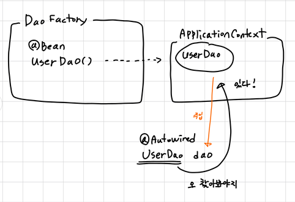

# Toby Spring

# 2장 테스트

스프링에서 제일 중요한 가치는 객체지향과 테스트라고 한다.

테스트를 쓰지 않으면 스프링의 절반을 포기하는 것과 같다. 

### 웹을 통한 DAO 테스트 방법의 문제점

DAO를 만든 뒤 바로 테스트하지 않고, 대충이라도 모든 코드를 다 작성한 뒤 웹으로 확인한다. 

여기서 에러가 나면 어디에서 문제가 발생했는지 알 수 있는가? → 테스트를 어떻게 만들면 이런 문제를 피할 수 있을까?

### 작은 단위의 테스트

테스트는 가능하면 작은 단위로 쪼개는 것이 좋다. (관심사의 분리도 여기에 적용된다.)

**UserDaoTest**

- 웹 인터페이스, MVC 클래스, 서비스 오브젝트, 배포도 필요 없는 간단한 테스트
- 오직 DB 연결 방법  or 어떻게 저장하고 가져오는가?에 대한 코드만 작성되어 있다.
- 그래서 오류가 발생하면 DB 연결 관련이나 UserDao 코드가 잘못 된거라는 걸 알 수 있다.

이렇게 작은 단위에 대한 테스트를 **단위 테스트(unit test)**라고 한다.

회원가입 → 로그인 → 활동 → 로그아웃과 같은 긴 과정 테스트도 필요하지만, (묶으면 안 되는 경우가 종종 있음) 여기서 오류가 터지면 하나하나를 다 검증해야 하기에 미리 **작은 단위 테스트를 작성해 두는 것이 좋다.**

### 지속적인 개선과 점진적인 개발을 위한 테스트

초난감 DAO를 계속 고치면서 잘 작동하는지 바로 확인할 수 있었던 건 바로 테스트 덕분이다.

> 
> 
> - 테스트 코드가 바로 검증해주니 시간 절약이 많이 될 거 같다.
> - 하지만 기능을 너무 많이 수정하여 테스트 코드도 결국 수정해야 한다면, 두 배로 더 힘들지 않을까?
> - 테스트 작성도 쉽지 않다. 여러 검증 케이스를 생각해야 하고, 기능 구현 만큼이나 많은 코드를 작성해야 한다. (요즘은 ai가 다 해주지만…)

### UserDaoTest 문제점

1. 수동 확인 작업의 번거로움 → get() 값 일치하는지 확인은 사람 눈으로
2. 실행 작업의 번거로움 → 여러 테스트를 작성하면? main() 메서드를 여러 번 실행해야됨

---

## JUnit 테스트

자바 단위 테스트를 만들 때 쓰이는 테스트 도구이다.

- **테스트 메서드 전환**
    - `main()` 메서드를 일반 메서드로 옮긴다.
    - `public`로 선언할 것 (근데 여태 default로 선언했던 거 같은데 문제 없나?)
    - `@Test` 어노테이션을 붙일 것

> 
> 
> 
> 
> | **Unit 버전** | **테스트 클래스/메서드 제약** | **이유** |
> | --- | --- | --- |
> | **JUnit 3/4** | 반드시 **`public`** 이어야 함 | 리플렉션(Reflection) 매커니즘이 외부 패키지에서 접근 가능한 `public` 요소만 찾도록 설계됨. |
> | **JUnit 5** | **`public` 또는 `default`** 가능 | JUnit 5 엔진은 같은 패키지 내에 있다면 `default` 접근 제어자도 인식할 수 있도록 유연하게 설계됨. (단, `private`은 불가) |
> 
> **→ 캡슐화와 가독성 때문에 주로 default를 권장한다.**
> 

```java
import org.junit.jupiter.api.Test;

public class UserDaoTest {

	// 인텔리제이는 @Test 옆에 alt + enter 치면 JUnit 연결할 수 있다.
  @Test
  void 추가와_가져오기_검증() throws SQLException {
    ApplicationContext context = new
    ...
  }
}
```

### 검증 코드

`assertThat()` → 값을 비교하여 일치하면 다음으로 넘어가고, 불일치하면 테스트가 실패한다.

```java
// hamcrest는 JUnit4 시절에 표준처럼 사용되던 라이브러리
assertThat(user2.getName(), is(user.getName()));

// AssertJ의 isEqualTo()를 더 많이 사용
assertThat(user2.getName()).isEqualTo(user.getName());
```

### 실행하기

인텔리제이의 왼쪽 초록색 재생 버튼을 통해… (JUnit5 부터 특정 클래스의 main 메서드를 호출하는 방식이 아닌, 프로젝트 전체를 스캔하여 테스트를 찾아내는 방식으로 바뀜)

### deleteAll() 추가

매번 테스트를 실행하기 전 테이블 데이터를 계속 삭제해야 함 → 매우 귀찮음

```java
void deleteAll() ...
```

### getCount()

USER 테이블의 레코드 개수를 돌려준다.

```java
int getCount() ...
```

문제는 테스트를 실행할 때마다 두 메서드를 계속 사람이 실행해야함 → 자동화가 아니잖아

addAndGet() 메서드 내에 deleteAll(), getCount()를 넣어준다. 

→ 사실 `@AfterEach`을 사용하는게 더 낫지 않을까

```java
  @AfterEach
  void tearDown() {
	  dao.deleteAll();
	  ...
  }
```

- **JUnit 테스트 주의할 점**
    - JUnit은 특정 메서드 실행 순서를 보장해주지 않는다.
    - 테스트 실행 순서에 영향을 받는다면 잘못 만든거임
    - 실행 순서에 상관없이 독립적으로 동일한 결과를 낼 수 있도록 하자

---

### get() 메서드의 예외상황 테스트

`@Test(expected=Empty~.class)`는 JUnit4 방식이므로 JUnit5 방식으로 사용해보겠습니다.

- **assertThrows**

```java
// DataNotFoundException 커스텀 예외처리 만들었다고 가정
@Test
void 없는_id를_조회하면_예외를_던진다() {		
	// when
	DataNotFoundException ex = assertThrows(DataNotFoundException.class, () -> {
		dao.get(없는id);
	});
	
	// then
	assertThat(ex.getMessage()).isEqualTo("해당 회원이 존재하지 않습니다.");
}
```

`assertThrows`을 사용하면 assertThat으로 더 많은 검증을 할 수 있다. (에러 코드, State 값 등등)

- **assertThatThrownBy (AssertJ)**

```java
@Test
void 없는_id를_조회하면_예외를_던진다() {		
	// when & then
	assertThatThrownBy(() -> dao.get("없는id"))
					.isInstanceOf(DataNotFoundException.class)
           .hasMessage("해당 회원이 존재하지 않습니다.");
}
```

코드가 더 간결해진다.

### 개발자가 테스트를 만들 때 자주 하는 실수

바로 성공하는 테스트만 만들기 → 예외 상황에서 예외 처리가 안되면? ㅠㅠ

실제 서비스 환경에서도 사람들이 무슨 이상한 짓을 할지 모르니 예외 상황을 꼼꼼히 테스트하자.

---

## 테스트 주도 개발

만들고자 하는 기능의 내용을 담고 있으면서 만들어진 코드를 검증도 해줄 수 있도록 테스트 코드를 먼저 만든다. → **테스트 주도 개발 (Test Driven Development)** 

TDD는 테스트를 먼저 만들고 그 테스트가 성공하도록 하는 코드만 만들기 때문에 테스트를 빼먹지 않고 꼼꼼하게 만들 수 있다.

> 안 되는 테스트를 되게 하려고 시간만 날리면…? 어떡하지
많은 훈련이 필요할 것 같다. 언제 어디서 써야 하는지 판단을 잘 해야 할 듯
> 

### 반복되는 코드 별도로 뽑아내기

**@BeforeEach**  (JUnit5)

- @Test 실행 전 @BeforeEach가 붙은 메서드를 먼저 실행한다.

```java
Public class UserDaoTest {

	private UserDao dao;  
	
	@BeforeEach
	void setUp() {
		// dao에 담을 코드 작성...
		...
		this.dao = context.getBean("userDao", UserDao.class);
	}
}
```

**JUnit 프레임워크의 실행 과정**

1. @Test가 붙은 메서드를 찾는다.
2. 테스트 클래스의 오브젝트를 하나 만든다.
3. @BeforeEach가 붙은 메서드가 있으면 실행한다.
4. @Test가 붙은 메서드 하나 호출하고 결과를 저장한다.
5. @AfterEach가 붙은 메서드를가 있으면 실행한다.
6. 나머지 2~5번을 반복한다
7. 모든 테스트의 결과를 종합해서 돌려준다.

근데 왜 실행할 때마다 오브젝트를 새로 만들까? → 각 테스트가 서로 영향을 주지 않고 독립적으로 실행됨을 보장하기 위해서

테스트 일부!에서만 공통적으로 사용되는 코드가 있다면? → @BeforeEach 보다는 메서드 추출을 하는게 낫다. 

### 픽스처

테스트를 수행하는 데 필요한 정보나 오브젝트

반복적으로 사용하기 때문에 @Before 메서드를 이용해 생성하면 편하다.

---

## 스프링 테스트 적용

애플리케이션 컨텍스트는 생성에 많은 시간과 자원이 소모된다. 그래서 테스트 전체가 공유하는 오브젝트를 만들기도 한다. 

다행히도 애플리케이션 컨텍스트는 내부 상태가 바뀌는 일이 없기 때문에 한 번만 만들고 여러 테스트에 공유해서 사용해도 된다. → 이렇게 하면 시간 많이 단축됨!

```java
@ExtendWith(SpringExtension.class)
@ContextConfiguration(classes = DaoFactory.class)
public class UserDaoTest {

	@Autowired
	private ApplicationContext context;
	
	@BeforeEach
	void setUp() {
		this.dao = this.conetext.getBean("userDao", UserDao.class):
	}
}
```

@ExtendWith(SpringExtension.class) → JUnit5에서 스프링 기능을 사용하겠다고 언

@ContextConfiguration(classes = DaoFactory.class) → 객채를 어떻게 만들고 서로 연결할지는 DaoFactory에 적혀있다. (미리 캐싱함)

### @Autowired

스프링 DI에 사용되는 특별한 어노테이션이다. @Autowired 붙은 인스턴스 변수가 있으면 테스트 컨텍스트는 변수 타입과 일치하는 컨텍스트 내의 빈을 찾는다. 



### 근데 왜 테스트 환경에서 @Autowired을 사용함?

- JUnit 같은 테스트 프레임워크는 **매개변수가 없는 기본 생성자를 통해 클래스를 만든다.**
- 객체가 아닌 단순히 실행을 위한 도구일 뿐
- 테스트 환경에서는 빈이 여러개 필요할 수 있음. 이땐 컨테이너에서 가져오는게 맞다.

---

### 학습 테스트

자신이 만들지 않은 프레임워크나 라이브러리 확인하는 테스트를 작성하는 것이다.

자신이 사용할 api나 프레임워크의 기능을 테스트로 보면서 사용 방법을 익히려는 것이다.

### 버그 테스트

오류가 있을 때 그 오류를 가장 잘 드러내줄 수 있는 테스트를 말한다.

버그가 원인이 되어 테스트가 실패하는 코드를 만든다.